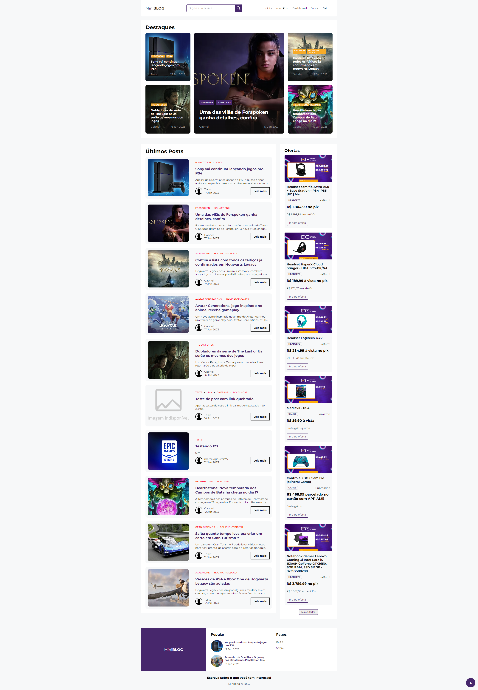

## Preview

<h1 align="center">
    
</h1>

<br>

## ⚙️ Tecnologias

Este projeto foi desenvolvido utilizando:

- [ReactJS](https://reactjs.org/)
- [Typescript](https://www.typescriptlang.org/)
- [Jodit](https://github.com/xdan/jodit)
- [Firebase](https://firebase.google.com/)

## 📌 Começando

Clone o projeto:

```bash
git clone https://github.com/gabrielcoutinh0/miniblog.git
cd miniblog
```

Instale as dependências :

```bash
npm install or npm i
npm run dev
```

Crie um projeto no firebase, será utilizado:

```bash
Authentication
Firestore Database
```

Após criar o projeto no firebase crie um arquivo com nome de ".env.local" na raiz do projeto e adicione as credenciais.

```bash
VITE_API_KEY = apiKey
VITE_AUTH_DOMAIN = authDomain
VITE_PROJECT_ID = projectId
VITE_STORAGE_BUCKET = storageBucket
VITE_MESSAGING_SENDER_ID = messagingSenderId
VITE_APP_ID = appId
```

## 🖼️ Layout

- [Inspiration](https://atlas-demo.blogspot.com/)
- [Udemy](https://www.udemy.com/course/react-do-zero-a-maestria-c-hooks-router-api-projetos/)
